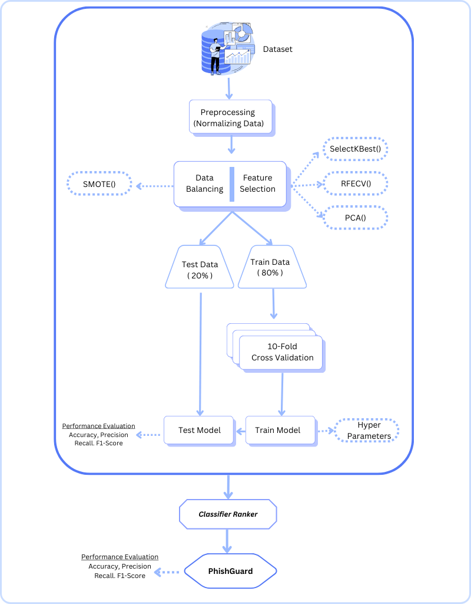
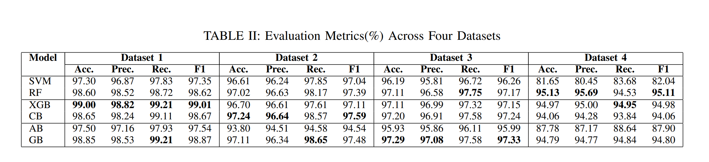

## 📄 Paper

**Title**  
**PhishGuard: A Multi‑Layered Ensemble Model for Optimal Phishing Website Detection**

**Authors**  
Md Sultanul Islam Ovi · Md Hasibur Rahman · Mohammad Arif Hossain

**Abstract**  
Phishing attacks are a growing cybersecurity threat that rely on deceptive websites to steal sensitive information. This paper introduces **PhishGuard**, a custom multi-layered ensemble model that improves phishing site detection. The model integrates multiple machine learning classifiers including Random Forest, Gradient Boosting, CatBoost, and XGBoost. It uses advanced feature selection methods such as SelectKBest and RFECV, along with hyperparameter tuning and data balancing techniques. PhishGuard was trained and evaluated using four publicly available datasets and outperformed state-of-the-art models, achieving up to 99.05% accuracy. The results show that combining optimization methods with ensemble learning significantly enhances phishing detection performance.

**Conference**  
*2024 6th International Conference on Sustainable Technologies for Industry 5.0 (STI), IEEE*

**PDF**  
[IEEE Xplore Link](https://ieeexplore.ieee.org/abstract/document/10951075)

**BibTeX**
```bibtex
@inproceedings{ovi2024phishguard,
  title={PhishGuard: A Multi-Layered Ensemble Model for Optimal Phishing Website Detection},
  author={Ovi, Md Sultanul Islam and Rahman, Md Hasibur and Hossain, Mohammad Arif},
  booktitle={2024 6th International Conference on Sustainable Technologies for Industry 5.0 (STI)},
  pages={1--6},
  year={2024},
  organization={IEEE}
}
```

---

## 🔗 Resources

### Datasets  
- [Phishing Website Data Set](https://example.com/phishing‑dataset)

### Figures  

#### Overview  


#### Results  
  
  
  


---
